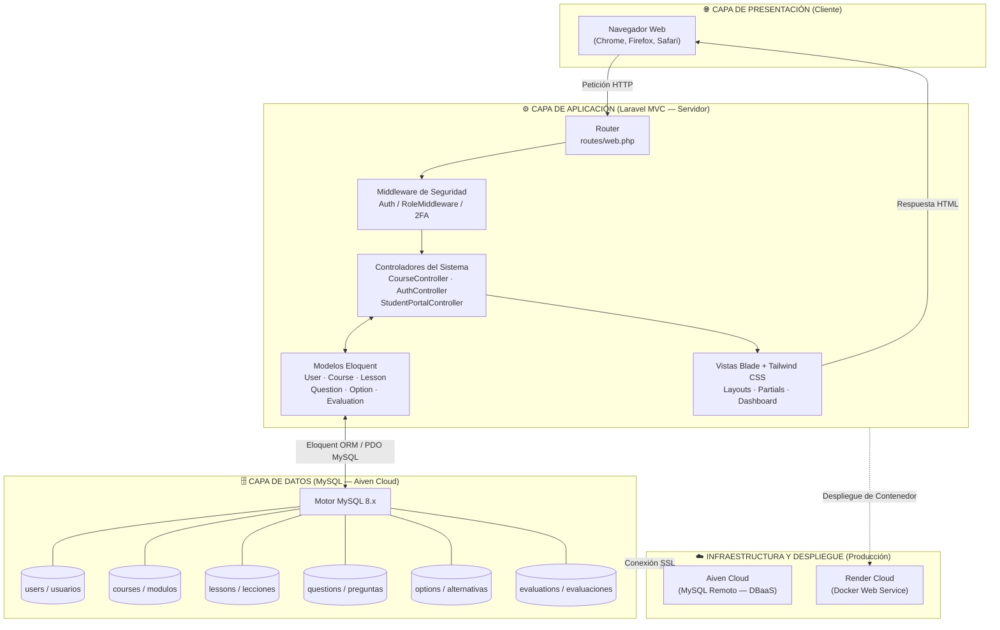
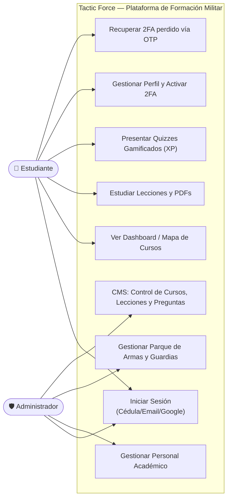
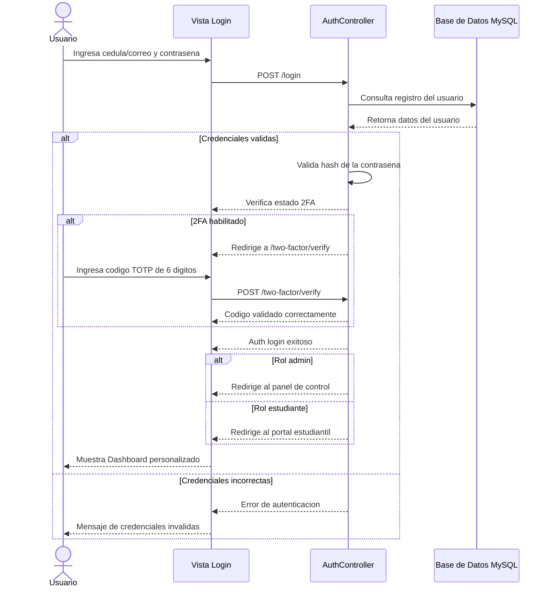
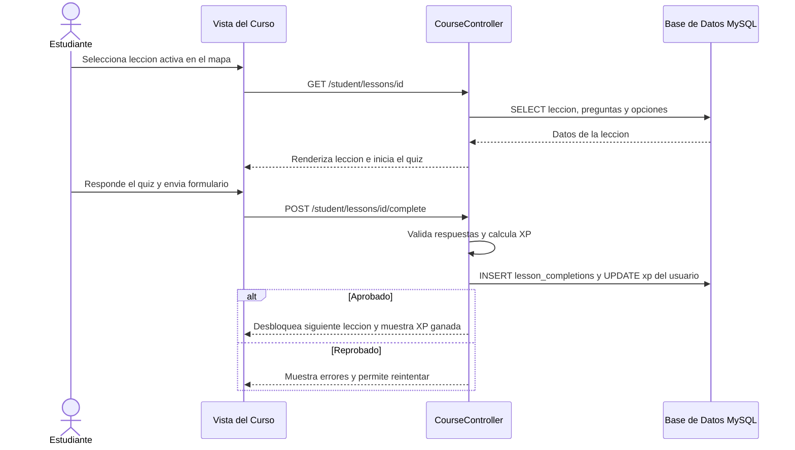
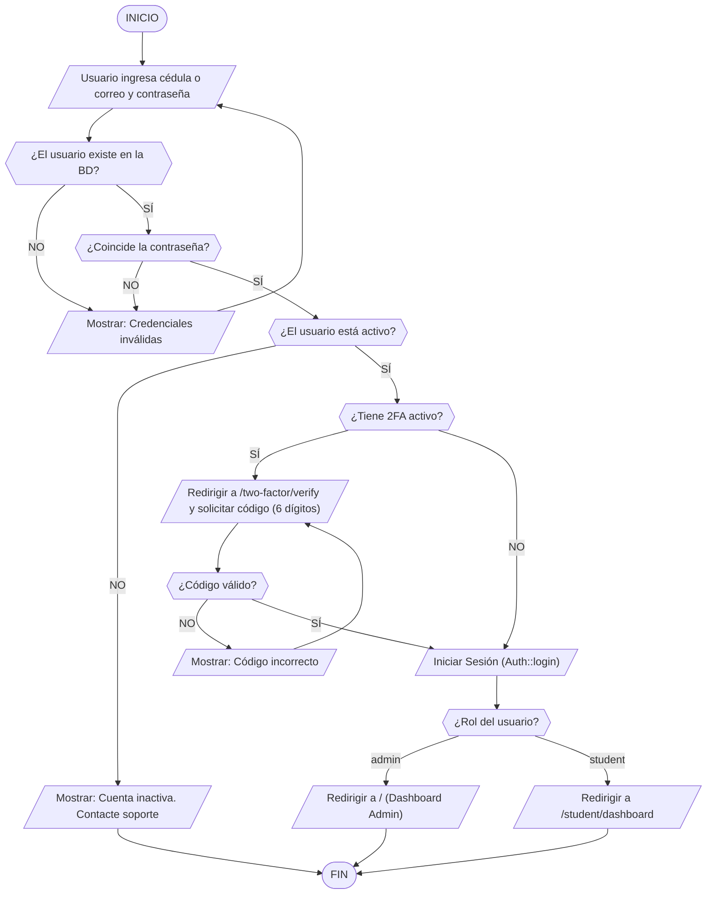
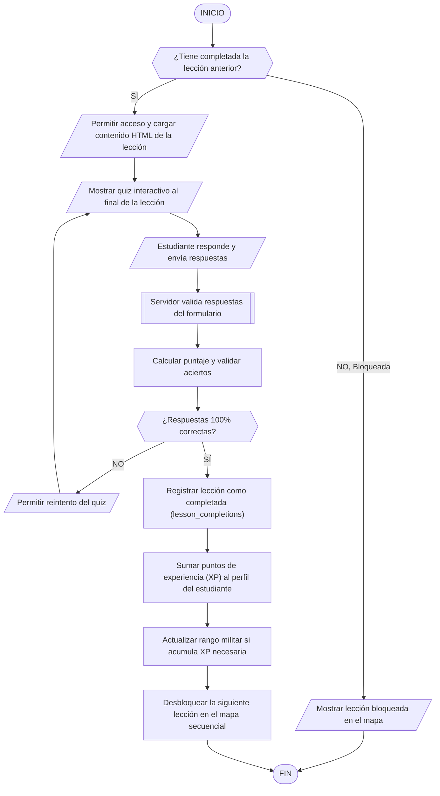
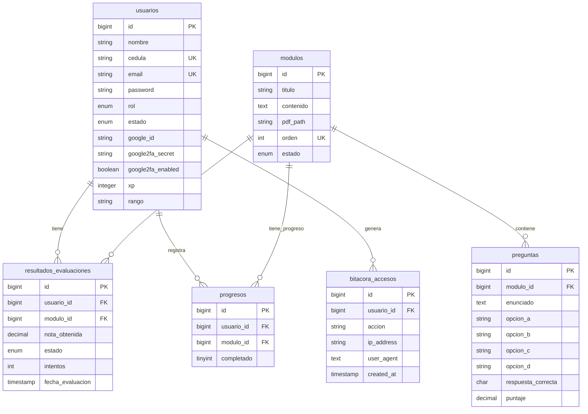

# 🛡️ Tactic Force — Sistema Web de Formación en Conocimientos Militares

<p align="center">
  
  
  
  
  
</p>

---

## 📝 Descripción del Proyecto

**Tactic Force** es una plataforma educativa interactiva tipo LMS (Learning Management System) orientada a la formación cívico-militar de **estudiantes universitarios** en conocimientos militares y estrategias tácticas. La aplicación ofrece una experiencia gamificada de aprendizaje y un panel de gestión integral diseñado para instituciones de educación superior con componente militar.

El sistema se divide en dos grandes áreas funcionales:

### 👤 Portal del Estudiante (Gamificado)
* **Mapa de Cursos Estilo Duolingo**: Rutas de aprendizaje secuenciales (Módulos M1 a M7) donde las lecciones se desbloquean a medida que se aprueban las anteriores.
* **Lecciones Interactivas en HTML**: Visualización directa de contenidos didácticos cargados dinámicamente desde el servidor con soporte para recursos y manuales en PDF.
* **Quizzes Gamificados**: Evaluaciones rápidas con ganancia de puntos de experiencia (XP) y ascenso en los rangos militares del perfil del usuario.
* **Seguridad y Perfil**: Activación y desactivación de autenticación de doble factor (2FA), cambio de contraseña y soporte para autenticación con Google OAuth.

### 🛡️ Panel del Administrador (CMS Táctico)
* **Gestión CMS de Contenidos**: Editor visual completo para la creación y edición de cursos, lecciones (con vista previa en vivo en HTML y soporte de etiquetas seguras) y banco de preguntas para los cuestionarios.
* **Fichero Académico e Infraestructura**: Administración de personal militar, control y asignación del Parque de Armas (Armería), programación de roles de guardia y bitácora detallada de accesos para auditorías.
* **Control de Categorías**: Organización de temarios clasificados en Doctrina General, Operaciones Terrestres, entre otras.

---

## 👨‍💻 Autores y Desarrollo Académico

* **José Sierra** (C.I: 31.149.881) — Coordinador General y Desarrollador Backend Principal.
* **José Salcedo** (C.I: 31.559.727) — Analista de Sistemas, Diseñador UI/UX y Documentador.

* **Docente de la Asignatura:** MSc. Robert González
* **Institución:** Universidad Nacional Experimental Politécnica de la Fuerza Armada Nacional Bolivariana (UNEFA), Núcleo Falcón.

---

## 🏛️ Arquitectura y Modelado del Sistema

El sistema utiliza el patrón de diseño **Modelo-Vista-Controlador (MVC)** sobre Laravel, con una base de datos **MySQL** alojada en la nube mediante el servicio gestionado de **Aiven Cloud**, ideal para la persistencia robusta y el despliegue continuo en entornos de producción (Render).

### 1. Diagrama de Arquitectura de Capas y Despliegue
Este diagrama muestra el flujo de la petición del cliente y cómo interactúa con el servidor Laravel y la base de datos MySQL remota en Aiven Cloud, desplegado mediante Docker en Render:



---

### 2. Diagrama de Casos de Uso del Sistema
El diagrama de casos de uso describe el alcance operativo de los dos perfiles principales:



---

### 3. Diagrama de Secuencia — Autenticación Segura y Doble Factor (2FA)
Muestra el flujo cronológico de mensajes al iniciar sesión y validar el código de Google Authenticator:



---

### 4. Diagrama de Secuencia — Cuestionario y Progreso Académico
Representa el flujo de avance cuando un estudiante interactúa con el mapa Duolingo y completa una lección:



---

### 5. Diagrama de Flujo — Login y Validación de 2FA
Muestra las decisiones lógicas tomadas por el controlador durante el flujo de inicio de sesión seguro:



---

### 6. Diagrama de Flujo — Avance Temático y Gamificación
Representa el algoritmo secuencial del mapa de aprendizaje:



---

### 7. Esquema Conceptual de la Base de Datos (6 Tablas Académicas)
Para fines de la defensa académica del proyecto de grado ante la UNEFA, se modela conceptualmente la base de datos bajo un esquema unificado de 6 entidades óptimas:



---

## 🛠️ Stack Tecnológico

| Componente | Tecnología | Versión | Función en el Proyecto |
|---|---|---|---|
| **Backend Core** | Laravel | v11.x | Framework principal MVC de la aplicación |
| **Lenguaje Servidor** | PHP | 8.4 | Lenguaje del lado del servidor utilizado |
| **Base de Datos** | MySQL | 8.x | Motor de base de datos relacional en la nube |
| **DBaaS Cloud** | Aiven Cloud | — | Hosting gestionado de MySQL (conexión SSL) |
| **Frontend Engine** | Blade | — | Motor de plantillas dinámicas de Laravel |
| **Maquetado y Estilos** | CSS / Tailwind CSS | — | Framework de estilos y responsive design militar |
| **Autenticación Externa** | Google OAuth | — | Login social seguro para usuarios registrados |
| **Doble Factor (2FA)** | Google Authenticator | — | Generación de tokens OTP y sincronización QR |
| **Contenedores** | Docker | — | Empaquetado del software para el despliegue |
| **Servidor de Producción** | Render Cloud | — | Hosting web del contenedor Docker en producción |
| **Suite de Pruebas** | PHPUnit / Feature Tests | 10.x | Pruebas de integración para autenticación, 2FA y CMS |

---

## 🔑 Acceso al Sistema (Demo)

El seeder del proyecto crea cuentas de prueba automáticamente al ejecutar `php artisan migrate --seed`. Las credenciales reales de producción **no se incluyen aquí por razones de seguridad** — deben ser configuradas por el administrador del sistema en el archivo `.env` y en el seeder correspondiente.

### 👤 Portal del Estudiante (`/login`)
* **Email**: La cuenta demo se define en `database/seeders/StudentPortalSeeder.php`
* **Contraseña**: Configurada en el seeder (ver archivo mencionado)
* **Inicio de sesión alternativo**: Google OAuth disponible

### 🛡️ Portal del Administrador (`/admin/login`)
* **Email**: Definido en `database/seeders/DatabaseSeeder.php`
* **Contraseña**: Configurada por el administrador del proyecto

> ⚠️ **Nota de seguridad:** Si vas a desplegar este proyecto, asegúrate de cambiar las credenciales del seeder y definir contraseñas robustas antes del primer deploy en producción.

---

## 🚀 Instalación y Ejecución Local

### Requisitos Previos
1. **PHP 8.4** instalado en el sistema.
2. **Composer 2.x** configurado en PATH.
3. **MySQL 8.x** (o una cuenta en [Aiven Cloud](https://aiven.io/) para la base de datos remota gratuita).
4. **Git** para control de código.

### Pasos de Configuración

```bash
# 1. Clonar el repositorio
git clone https://github.com/Jose-Sierra082005/sistema-militar-unefa.git
cd sistema-militar-unefa

# 2. Instalar las dependencias de Laravel
composer install

# 3. Copiar las variables de entorno
cp .env.example .env

# 4. Generar la clave única de encriptación
php artisan key:generate

# 5. Configurar la conexión MySQL en el archivo .env
#    Editar .env y completar: DB_HOST, DB_PORT, DB_DATABASE, DB_USERNAME, DB_PASSWORD
#    (Usar credenciales del servicio MySQL en Aiven Cloud)

# 6. Correr las migraciones y poblar con datos iniciales (seeder)
php artisan migrate --seed

# 7. Iniciar el servidor local
php artisan serve
```

El portal de desarrollo estará accesible en: **[http://localhost:8000](http://localhost:8000)**

---

## 🧪 Pruebas y Calidad de Código

Para garantizar la estabilidad y consistencia de las nuevas funcionalidades (recuperación 2FA, CMS de Cursos, Autenticación), puedes ejecutar la suite de pruebas del proyecto:

```bash
# Ejecutar los feature tests
php artisan test

# Comprobar el estándar de código con Laravel Pint
./vendor/bin/pint --test
```

---

## 📖 Documentación Técnica Autogenerada

El código del proyecto se encuentra documentado internamente siguiendo el estándar **PHPDoc**. Puedes autogenerar el sitio web de la documentación técnica (clases, controladores y métodos) ejecutando el siguiente comando con Docker (sin necesidad de instalaciones locales adicionales):

```bash
# Ejecutar desde la raíz del proyecto para generar el sitio web estático en docs/api
docker run --rm -v "${PWD}:/data" phpdoc/phpdoc:3 run -d /data/app -t /data/docs/api --no-interaction
```

Una vez completado, abre el archivo `docs/api/index.html` en cualquier navegador web para explorar la estructura técnica detallada del sistema.

---

## 📄 Licencia y Propósito Académico

Esta aplicación es un **proyecto académico de carácter formativo y sin fines de lucro**, desarrollado para la **UNEFA Núcleo Falcón** en el marco de las materias de *Implantación de Sistemas* y *Metodología*. Todos los derechos sobre la marca **Tactic Force** y su diseño pertenecen a sus respectivos autores.
