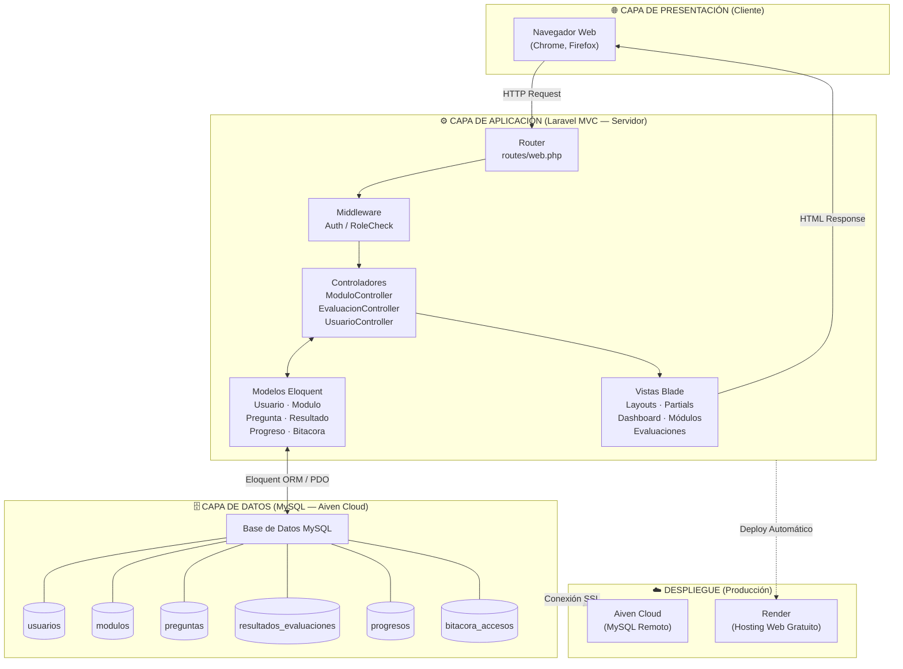
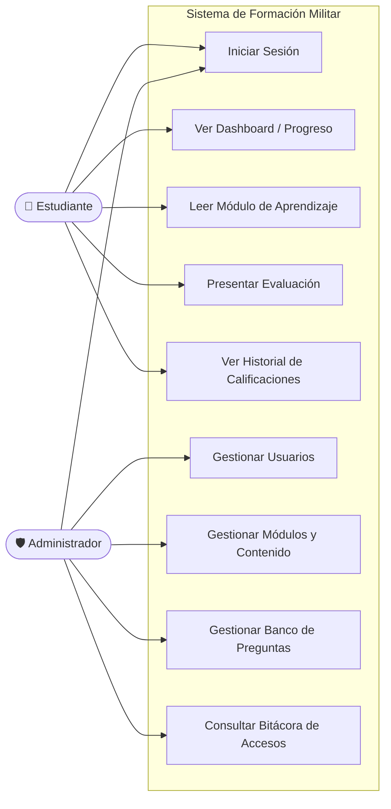
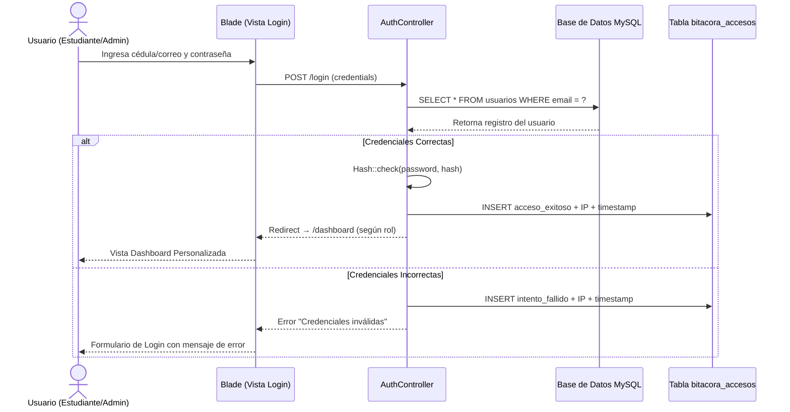
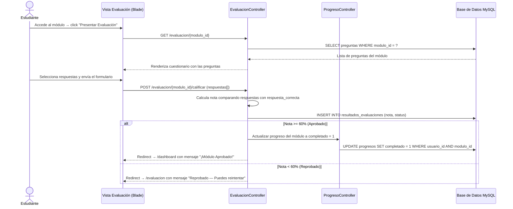
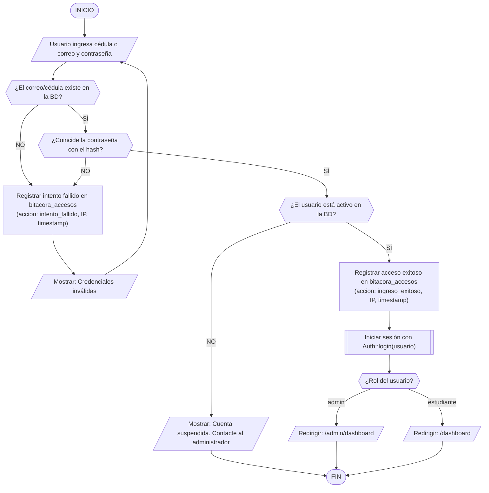
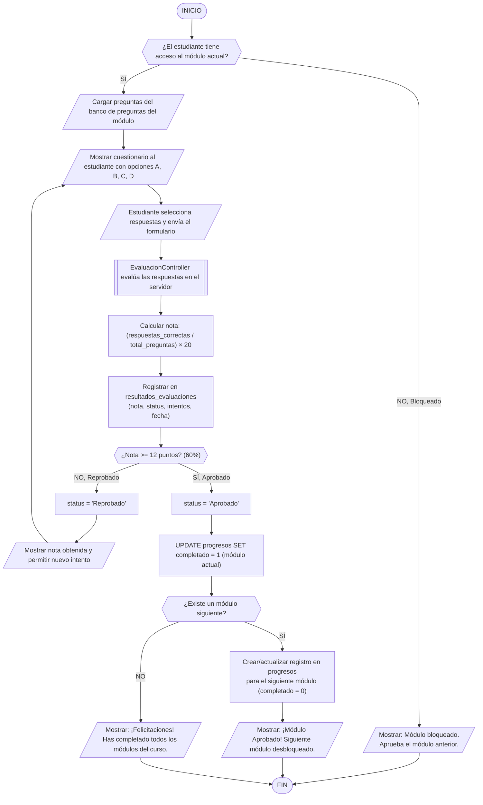
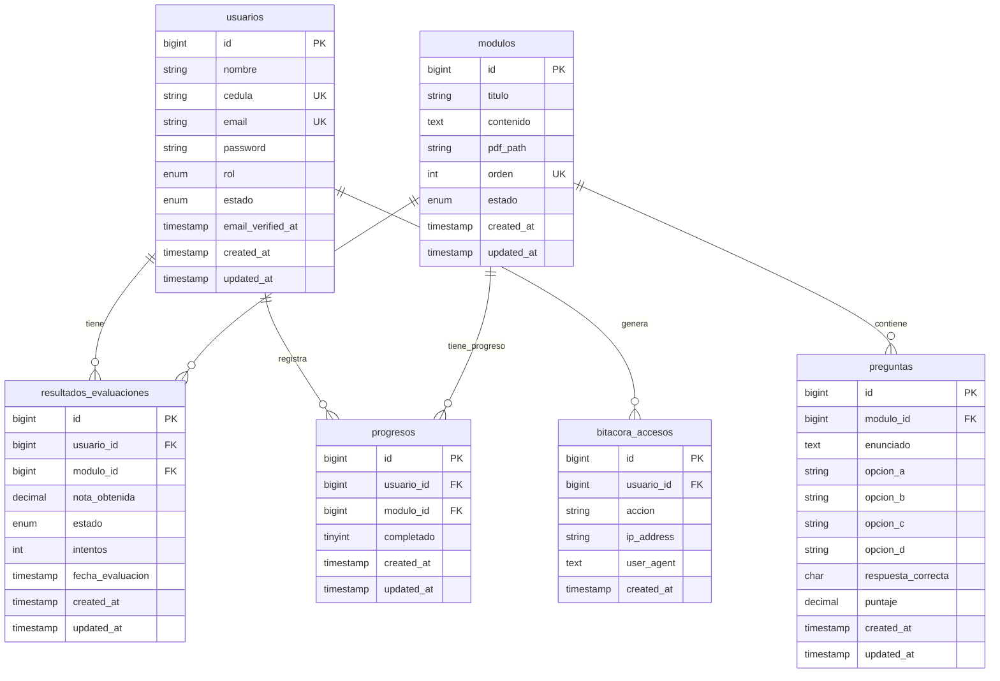

    

---

# 🎖️ Sistema Web de Formación en Conocimientos Militares

**Aplicación Web para la Formación de Estudiantes Universitarios en Conocimientos Militares y Estrategias Tácticas**

> Proyecto académico desarrollado en el marco de las materias **Implantación de Sistemas** y **Metodología** — Ingeniería de Sistemas, UNEFA Núcleo Falcón.

---

## 📋 Descripción del Sistema

Plataforma educativa tipo LMS (Learning Management System) desarrollada con el framework PHP **Laravel**, orientada a centralizar y estructurar la instrucción cívico-militar para estudiantes universitarios. El sistema permite:

- 📚 **Gestión de Módulos de Aprendizaje**: Creación, edición y publicación de lecciones temáticas con soporte para archivos PDF.
- 🔐 **Autenticación y Control de Acceso por Roles**: Módulo de login seguro con roles diferenciados (`admin` / `estudiante`) y bitácora de auditoría.
- 📝 **Motor de Evaluaciones**: Cuestionarios dinámicos de opción múltiple (A, B, C, D) con calificación automática del servidor.
- 📈 **Seguimiento de Progreso Secuencial**: Sistema de desbloqueo progresivo que habilita el siguiente módulo sólo si el anterior fue aprobado.
- 🛡️ **Registro de Auditoría (Bitácora)**: Trazabilidad de todos los accesos, sesiones e intentos de autenticación por usuario e IP.

---

## 👨‍💻 Autores

| Nombre | Cédula | Rol en el Proyecto |
|---|---|---|
| José Sierra | C.I: 31.149.881 | Coordinador General y Desarrollador Principal (Laravel/Backend) |
| José Salcedo | C.I: 31.559.727 | Analista, Documentador y Diseñador de Interfaz (UI/UX) |

**Tutor Académico:** MSC. Robert González

---

## 🏗️ Arquitectura del Sistema

El sistema sigue el patrón **MVC (Modelo-Vista-Controlador)** de Laravel con una conexión a base de datos MySQL en la nube (Aiven Cloud) y despliegue en Render.

### Diagrama de Arquitectura de Capas MVC



---

### Diagrama de Casos de Uso



---

### Diagrama de Secuencia — Flujo de Login y Acceso al Sistema



---

### Diagrama de Secuencia — Flujo de Evaluación y Actualización de Progreso



---

### Diagrama de Flujo — Algoritmo de Login Seguro con Bitácora



---

### Diagrama de Flujo — Presentación de Evaluación y Desbloqueo Secuencial



---

## 🗄️ Esquema de la Base de Datos (6 Tablas)



---

## 🚀 Instalación Local

### Requisitos Previos
- PHP >= 8.2
- Composer >= 2.x
- MySQL (local o cuenta en [Aiven](https://aiven.io/) para MySQL remoto gratuito)
- Laragon o XAMPP (entorno local recomendado en Windows)
- Git

### Pasos de Instalación

```bash
# 1. Clonar el repositorio
git clone https://github.com/[tu-usuario]/sistema-militar-unefa.git
cd sistema-militar-unefa

# 2. Instalar dependencias de PHP
composer install

# 3. Copiar el archivo de variables de entorno
cp .env.example .env

# 4. Generar la clave de la aplicación
php artisan key:generate

# 5. Configurar la base de datos en .env
#    Editar .env y completar las credenciales DB_HOST, DB_DATABASE, DB_USERNAME, DB_PASSWORD

# 6. Ejecutar las migraciones
php artisan migrate

# 7. (Opcional) Poblar la base de datos con datos de prueba
php artisan db:seed

# 8. Iniciar el servidor de desarrollo
php artisan serve
```

Acceder al sistema en: **http://localhost:8000**

---

## 🧪 Ejecutar las Pruebas

```bash
# Ejecutar toda la suite de pruebas
php artisan test

# Ejecutar con reporte detallado
php artisan test --verbose

# Verificar estilo de código (Linter)
./vendor/bin/pint --test
```

---

## 🛠️ Stack Tecnológico

| Tecnología | Versión | Función en el Proyecto |
|---|---|---|
| Laravel | v13.12 | Framework MVC principal del backend |
| PHP | 8.4 | Lenguaje de programación del servidor |
| MySQL | 8.x | Motor de base de datos relacional |
| Aiven Cloud | — | Hosting DBaaS gratuito para MySQL en la nube |
| Blade | — | Motor de plantillas para las vistas dinámicas |
| Bootstrap / Tailwind CSS | — | Frameworks de diseño CSS responsive |
| HTML5 / CSS3 / JS | — | Estructura, estilos e interactividad del cliente |
| Composer | 2.x | Gestor de dependencias PHP |
| PHPUnit | 12.5 | Suite de pruebas automatizadas |
| Laravel Pint | — | Linter y formateador de código PHP |
| Git | — | Control de versiones distribuido |
| GitHub | — | Repositorio remoto y colaboración |
| GitHub Actions | — | Pipeline CI/CD automático |
| Render | — | Plataforma de hosting para despliegue en producción |
| Laragon / XAMPP | — | Entorno de desarrollo local en Windows |

---

## 📁 Estructura del Proyecto

```
sistema-militar-unefa/
├── .github/
│   └── workflows/
│       └── ci.yml              # Pipeline de CI/CD (GitHub Actions)
├── app/
│   ├── Http/
│   │   ├── Controllers/        # Lógica de negocio (MVC - Controladores)
│   │   └── Middleware/         # Verificación de roles y autenticación
│   └── Models/                 # Modelos Eloquent (6 tablas)
├── database/
│   └── migrations/             # Migraciones de base de datos
├── resources/
│   └── views/                  # Vistas Blade (Frontend)
├── routes/
│   └── web.php                 # Definición de rutas HTTP
├── .env.example                # Plantilla de variables de entorno
├── .gitignore                  # Exclusiones del control de versiones
├── CHANGELOG.md                # Bitácora de cambios del proyecto
├── CONTRIBUTING.md             # Guía de contribución y estándares
├── composer.json               # Dependencias del proyecto PHP
└── README.md                   # Documentación principal (este archivo)
```

---

## 🔄 Flujo de Desarrollo (GitFlow)

Ver [CONTRIBUTING.md](./CONTRIBUTING.md) para la guía completa de ramas, commits y Pull Requests.

```
main ←── develop ←── feature/* / fix/* / docs/* / chore/*
```

> 🔒 La rama `main` está **protegida**. Ningún desarrollador puede hacer push directo. Todo cambio requiere un Pull Request con al menos **1 aprobación** del equipo y el pipeline de CI/CD en **verde**.

---

## 📄 Licencia

Proyecto académico desarrollado exclusivamente con fines educativos para la **UNEFA Núcleo Falcón** en el marco de las materias de Implantación de Sistemas y Metodología del semestre 2026-I.
